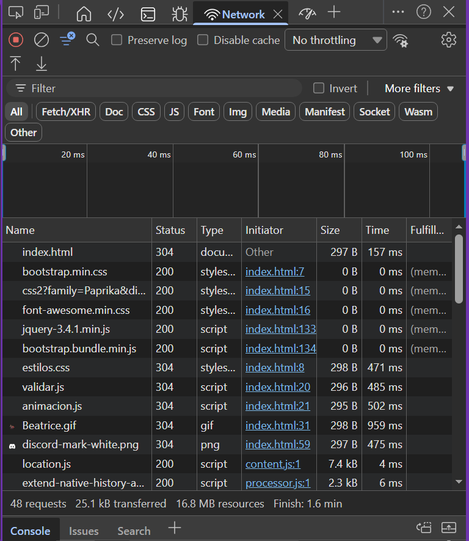
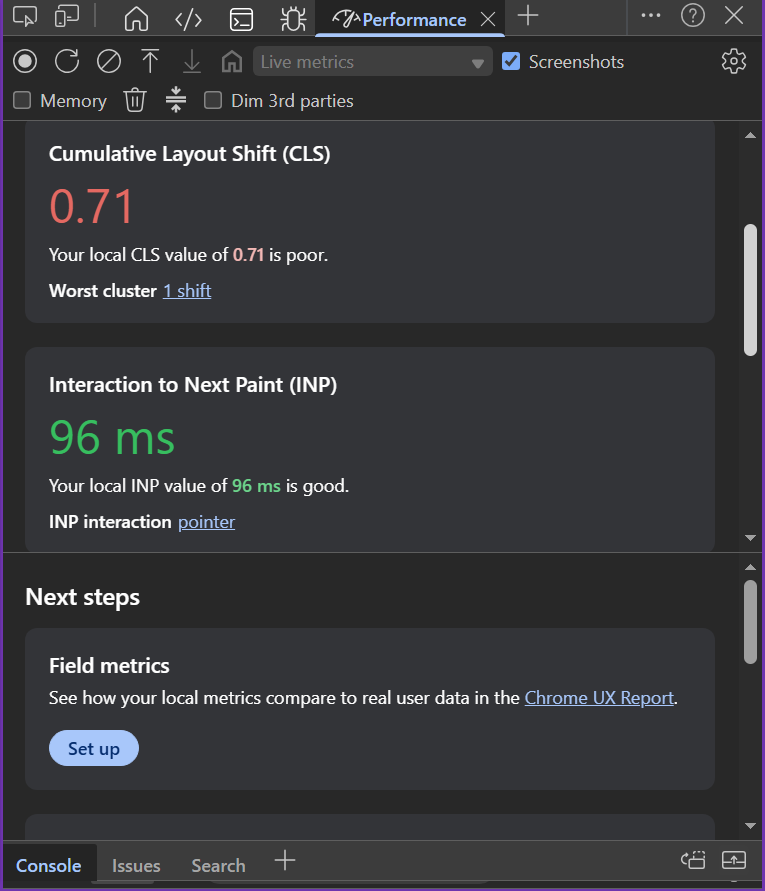

# Programación Multimedia - Evaluación 4
Estudiante: Vexayng Verenzuela

## Refactorización Modular
Refactorizar el código de JavaScript para que esté completamente organizado en funciones o módulos.

##  Manejo de Errores
Incluir un bloque de código que utilice try...catch para manejar una situación que podría causar un error.

##  Evaluación Técnica 
Utilizar las Herramientas de Desarrollo (DevTools) del navegador para inspeccionar su propio proyecto.

 Captura de pantalla del tab Console (limpio, sin errores) 

 Tab Performance o Network 

En la captura Network.png, destaca una oportunidad de optimización relevante:

Varios recursos (CSS, JS, imágenes) están retornando código de estado 304 (Not Modified), lo que indica que el navegador está revalidando en caché, pero aún así están consumiendo tiempo de red (entre 157 ms y 959 ms por recurso). Esto sugiere que las cabeceras de caché podrían no estar configuradas de manera óptima, causando peticiones condicionales innecesarias.

Métrica relevante:
La métrica CLS cuantifica cuánto se “mueven” los elementos de la página de manera inesperada mientras se carga o después de la carga inicial.
Se expresa como un puntaje decimal, donde:

0.0 = No hay desplazamientos. 
Mayor a 0.0 = Desplazamientos visibles. 
Objetivo ideal: ≤ 0.1 
Necesita mejora: 0.1–0.25 
Pobre: > 0.25 

Un CLS de 0.71 (pobre) podría estar relacionado con recursos (como Beatrice.gif, 959 ms) que cargan tarde y desplazan el contenido visual. Priorizar la carga de recursos críticos y asegurar caché eficiente puede ayudar a reducir el CLS.

